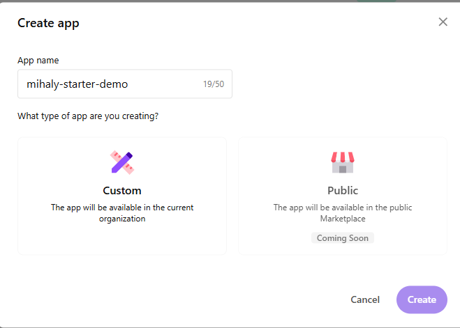
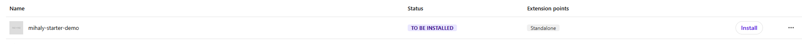
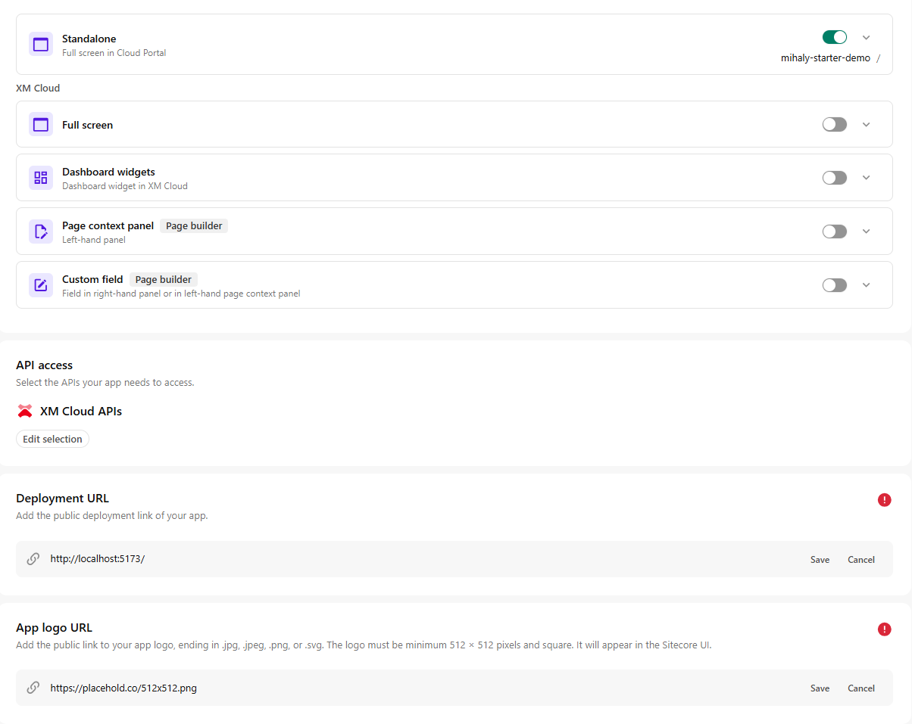

# Setup

1. Install dependencies and run the app in development mode:
   ```bash
   npm install
   npm run dev
   ```
2. Open [CloudPortal Developer Studio](https://portal.sitecorecloud.io/developer-studio)
3. Click the **Create App** button
4. Select **Custom App**, enter an App Name in the dialog, then click **Create**
   
   

5. Open the App Configuration Page
6. Allow **StandAlone** application in the Extension Point section
7. Enable the **Page context panel** and **Custom field** extension points as shown below:

   

   - **Page context panel**: `/page-context-example`
   - **Custom field**: `/color-picker-custom-field`

8. Allow **XM Cloud APIs** in the API Access section
9. Set **Deployment URL** to `http://localhost:3000/`
10. Set **App Logo URL** (e.g., `https://placehold.co/512x512.png`). The logo should be 512x512 pixels.
    
   

11. Click **Activate** in the top right corner
12. Your app is now activated. Go to the [My Apps](https://portal.sitecorecloud.io/my-apps) section on the cloud portal.
    
   

13. Click **Install** and select Tenants/Envs to give access to your app. Finally, click **Install**.
14. Go to the Cloud Portal Homepage and find your app in the **Marketplace Apps** section.

